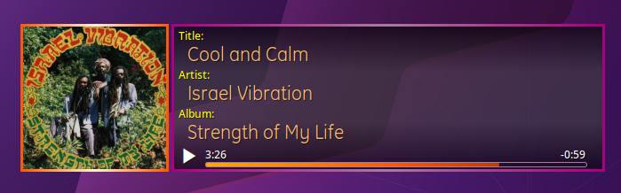

# Conky Spotify with Image Fix

[](https://www.gnu.org/licenses/gpl-3.0)

Enhanced Conky configuration for Spotify, fixing album art rendering issues in transparent windows.


Conky Spotify with Image Fix is an enhanced version of the [original Conky-Spotify](https://github.com/Madh93/conky-spotify) by Madh93. It resolves compatibility issues with rendering Spotify album art in transparent Conky windows using `transparent-image.lua`.

## Features
- Displays Spotify album art in Conky.
- Provides a fix for rendering album art in transparent Conky windows.
- Ensures compatibility with Spotify (with DBus support).

### Spotify-Conky-Redone



**Spotify-Conky-Redone** is an advanced version of **Conky Spotify with Image Fix**, featuring a Lua-rendered background, colored borders, and optimized performance. It caches album art as PNGs to reduce downloads, eliminates JPG storages. All rendering, previously handled in `conky.text`, is now managed by `display.lua` for greater flexibility.

## Requirements
To use this configuratsion, you need the following tools:
- **Conky**: A lightweight system monitor.
- **ImageMagick**: For album art conversion to a suitable format.
- **Spotify**: With DBus support enabled.

## Why PNG Conversion?s
This setup converts Spotify album art from JPG to PNG format using ImageMagick in the `cover.sh` script. The reasons for this conversion are:
- **Reliability**: Conky’s Cairo backend has native support for PNG, ensuring consistent rendering without black backgrounds or artifacts in transparent Conky windows.
- **Compatibility**: The `transparent-image.lua` script is designed to work with PNG images, avoiding the need for complex modifications to support JPG directly.
- **Quality**: PNG uses lossless compression, preserving the visual quality of album art without compression artifacts.
- **Simplicity**: Converting to PNG with ImageMagick is a robust, well-tested solution that integrates seamlessly with the existing Conky-Spotify setup.

## About Conky
Conky is a powerful and flexible system monitor for Linux/BSD systems. It can be customized to display various system statistics, such as CPU usage, memory, network information, and more. With proper configurations like this one, Conky can also display external data, such as Spotify information and album art.

## Installation
1. Clone this repository:
   ```bash
   git clone https://github.com/wim66/conky-spotify-imagefix.git
    ```
   copy conky-spotify to ~/.conky

   Conky-Spotify-Redone doesn't need to be moved, can be run from any directory through the use of relative paths.

    Ensure all requirements are installed:
        For Conky: Refer to your distribution's documentation.
        For ImageMagick: Install it via your package manager, e.g.:
        bash

        sudo apt install imagemagick

        Ensure Spotify with DBus support is installed.
    Customize the Conky configuration to your system if needed.

## Useful Links
- [Original Conky-Spotify by Madh93](https://github.com/Madh93/conky-spotify)
- [Conky](https://github.com/brndnmtthws/conky)

License

This project is licensed under the terms of the LICENSE file included in this repository. Please review it for details.
Acknowledgments

Thanks to Madh93 for the original work and inspiration for this configuration.

Enjoy this setup! For questions or issues, feel free to open an issue in this repository.
